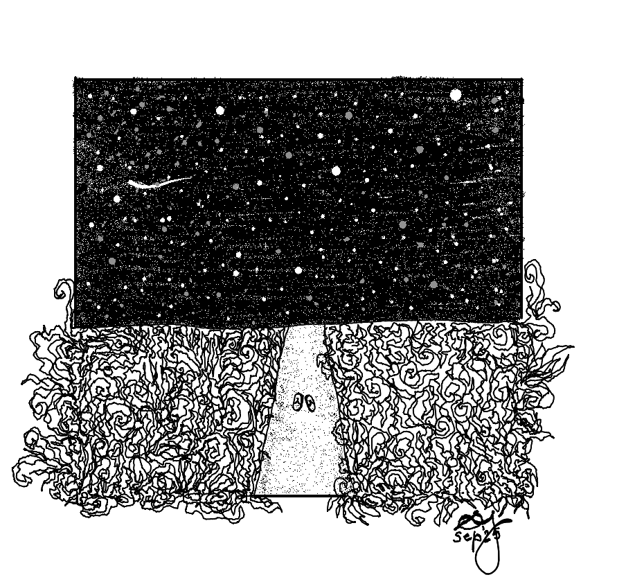
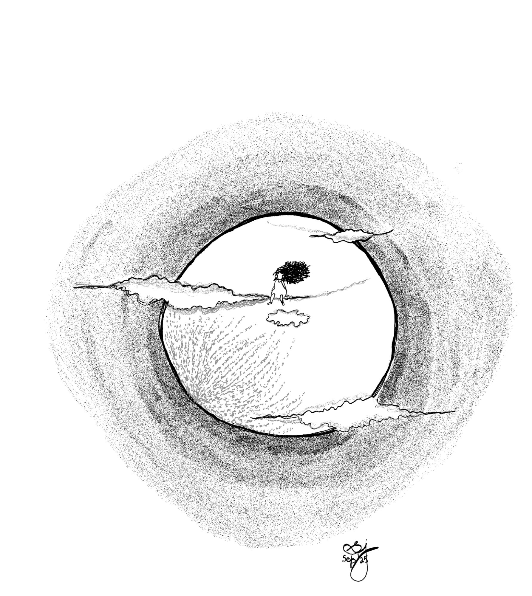
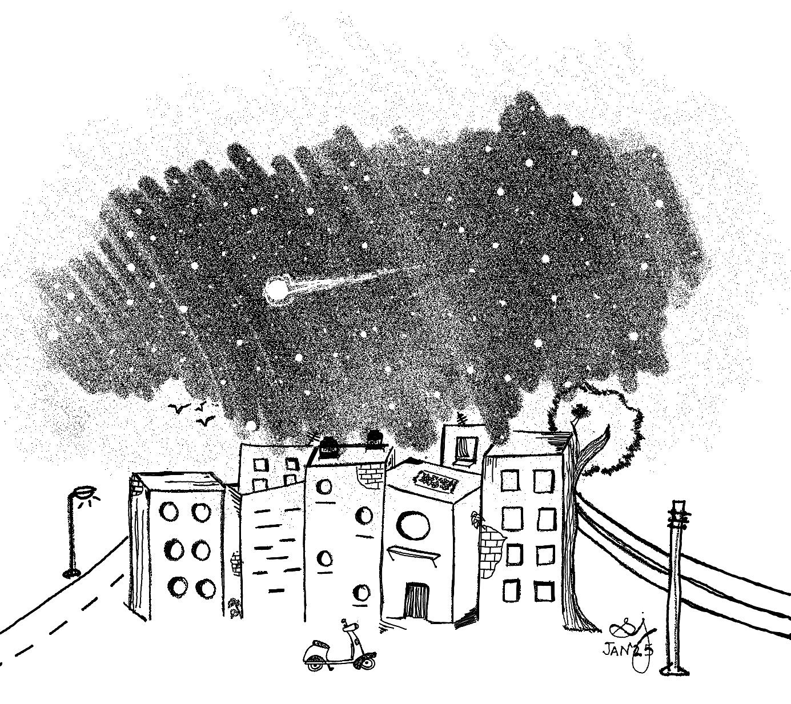

### I

### The walking path

Usually, you wouldn't find her doing this.
For her to be out after sunset with nobody within grabbing distance, transience was the reason. Before she returned to the room, and eventually to her city. Before everything around her became a saleable real estate dream for the likes of her to aspire for;
**Enchanted Forests.** Your greenest pincode. Apartments starting at Rs. 5.8 crore only.
**Le Tigre.** Leave your mark. Penthouses starting at two kidneys and a set of lungs.

And so, she was out here walking on this still wild path. Silence felt like the best companion to savour her environment. The landscape here held a mystery she did not wish to interrupt by voicing her presence.

The walking path was bereft of her city's noise and breathless pace of time. The grassy fields running parallel to the path echoed its character. They held a silence which was not borne from an absence of some other quality, or its deflection or suppression. This was a full-bodied silence which needed no other reason to exist. Looking around, she walked with a deliberate slowness. But this time, the excuse was not her meniscus torn right knee. Rather, this silence was the cause for a transition in her time-space fabric which was creating all the commas.

Out here, time and her did not feel as tightly bound. Time did not need to be minutely picked apart to the last zeptosecond and optimised. Tenets of her usual life — chores, deadlines, productivity, migraines — became irrelevant. Time could slip past her. She could ignore it. Or pay attention to it when the time-indoctrinated body demanded — for hunger, the moon, the new sun, curiosity.
Out here, she was enchanted and lost together. She was unaccustomed to being the only one on unending swathes of land. Her city was the most populated urban space in the human world. Her pincode alone had more people than the country of Malta.
Neither was she familiar with a silence where the non-humans rule. Her sleeping playlist was peppered with snores, mid-sleep mumbles, nightmare screams, faraway laughs, doors banging, furniture squeaking against the floor, residues of house parties, whistles and lathis, music from cars on late night drives threatening her bedroom windows with their booms, sleepless trucks honking at these cars to give way, two-wheelers evading gangs of chasing strays to deliver gated neighbourhood essentials like cigarettes, alcohols, chocolates, condoms, milk, eggs…

Away from that urban orchestra now, she was in awe of the vivid, sensorial landscape she was inhabiting; there was a primal tug from the breeze that this is how she should be alive on all her days, in such an undoctored cadence and flow.
Until the stored messages in her body surfaced, and fear took charge.
Alone, she did not know any comfort in silence. Had she ever been by herself, truly? Her city was the most surveilled in the world. Every three kilometres, she was under the gaze of over 1800 cctvs, functional or ornamental. This was to let her feel comfortable by herself wherever she was, whatever colours the sky wore. Although it was a political centre where the powerful were concerned about the safety of citizens whenever microphones appeared under their noses, the city was a horrifying place to be a woman. And so she had lived, always being watched and followed. In the beginning by a group of well-wishers. As she grew, so did this group and its concerns — what was she wearing, why was she showing her legs, who was she with, why did she not answer her phone, why did she want to go out at night, how could she behave however she wanted, why was she asking questions, when will she marry (have sex with a socially-approved boy), when will she bear a child (have unprotected, reproductive sex with *the* socially-approved boy), when will she shut up? Along with this bulging circle of well-wishers which rose like her chest, another group began taking interest in her body's measurements. They were a motley group of flashers with the always open fly, stalkers with agile moves, perverts coughing at the windows, middle-aged uncles pinching her breasts while giving her a side-eye, grandfathers who should have been on their deathbeds standing erect, and boys, oh the boys on the cycles and the bikes and their feet, whistling, singing, always asking if she would come, if they could give her a ride/if she would ride them. These groups became the reasons for the latest group which kept tabs on her — the machines.
The visceral appreciation of the quiet turned to distrust, manifesting in a hearable thudding of the heart. Shoulders, which were beginning to melt into her torso, began tensing. From wide and orbital, the eyes became knife-like, stabbing in the dark.
A fear of tuskers and tigers finding her would have been more realistic for a city dweller, given her location. But she was on alert for a different animal. Was the grass hiding any strange men with stranger ideas? What was that sound to the right? Where were all the streetlights?
Such questions let fear play with her innards, twisting the guts, tickling the pelvic floor, drying the throat.
But when no other forms materialised, no shadows made her scream, it brought the knowledge that she was truly, truly without unwanted company. Nothing watching her, nothing but her own senses guiding her. That in itself was something to be fearful of, if one considers one's own judgements and company so underwhelming or boring. But that was not her. Finally, the quiet of this place won the fearful city girl over. What hugged her now was a quiet of the 'It is not my problem' variety.
Everything wrong in the world was not her problem.
Her list of woes was not her problem.
She was outside the usual orbit of her life and its trickeries. In those moments after the fear was gone, she knew that the chaos in her life barely amounted to chaos at all. To this transient flow of time and space and self she surrendered, and lifted her head to the sky.

---

### II

### Comet

Using surveillance technology of a larger scale, an astronomer discovers a comet on a collision course with Earth. Or something along these lines. What follows is how different movies treat the ensuing paranoia fed chaos, and its resolution to make a blockbuster.

When comets are not a plot tool in popular culture to escalate a story's tension, and to allow fictional, mostly North American, white men — with help from colourful teams who clap/fist bump/don't get credit/die — to save the planet from annihilation[^1], they are their usual celestial bodies (gases, rocks, dust) which have been around since the formation of the solar system. We see them when they get closer to the sun during their travels from the farther reaches of the outer solar system or from relatively closer neighbourhoods around Neptune and Pluto. This is the short window where our paths cross, when we can look up and see them. Implicit in a comet's 'hey there' and 'so long' is a fundamental construct of human life: time.

---

### III

### On the walking path again

With feet digging into the earth, she was counting stars. The sky holding the universe was a texture and hue that belonged to another time in her life. Those skies had been smoked by her city's annual smog. Her hands patted her but found no phone. So, they were denied the pleasure of typing and finding the category of air quality index which fit the present place. Perhaps a parrot green 'good' more than a cantaloupe yellow 'moderate'. Surely not a coagulated blood coloured 'hazardous'.
Soon this nurturing environment — the skies, the walking path, the wild grasses — got forced into the background. She found herself surrounded by childhood friends, and by swarms of mosquitoes which made them quit their evening games, say their byes, and ring their respective doorbells. As the door to her home opened to pressure cooker whistles and the whirring sounds of pumping motors filling up water tanks, her body stepped into another moment. A younger mother, with longer, darker hair, an austere face suppressing all softness and playfulness that might give her children the idea to get close enough to her and take up her time, this mother sitting cross-legged with able knees and ankles next to her, and behind them, the palm green curtains. These curtains being pulled apart by a pair of hands, revealing a portion of the sky above the opposite four-storeyed building. And this portion of the skies, a twilight from the 1990s, hosting a traveler she was seeing for the first time: a comet.

---

### IV

### 1997

Her missionary school was mourning the death of Mother Teresa, a Catholic nun and later, saint. Her mother was grieving the death of a fellow married woman, daughter-in-law and mother of two children, Princess Diana. Her country was seeing its fiftieth year of independence from the princess's in-laws. She learnt that cheeks and foreheads were not the only places to plant a kiss, when it appeared that Aamir Khan pressed his lips on Juhi Chawla's pout during a song about ishq[^2]. The next year, Rose and Jack were about to give her many more lessons from a sinking ship[^3]. All these lovers frolicking away from or under the noses of their class conscious parents were tickling her pre-pubescent curiosity. So was the spacecraft Pathfinder when it landed on Mars, the news images of boulders and grainy, rough terrain making this neighbouring planet more than the flickering reddish star in her evening sky. So was the idea of becoming the first human to befriend a yeti, to be chosen for abduction by a UFO over any cattle from American farms[^4].

In a time which saw the mixing of such intimate and inter-galactic interests, she became invested when her mother said 'comet'. It was on its way to the sun, mother said, it had a very long tail, and they were going to see it for *some* time. This diversion from the Disneyesque 'forever' made seeing the comet a matter of significance. So, it became a routine. Pulling apart the green curtains, watching the comet soaring through the sky, mother next to her even though a thousand other things bayed for her labour. Against a sky she had made familiar based on her visual capacities — changing colours, flying birds, big dipper, clouds — this new celestial body with its very long tail felt magical, out of place. She told it about her day, waved until her wrists hurt, and wondered if she was visible to the comet through this rectangle of a window. The routine was temporary. Eventually, the comet left her view. Contrary to her fears about a T-Rex sized sense of loss after she could no longer see the comet, this period sank into the bentham zones of herself.
Until, many years later, when she was on that walking path.
Once again, the comet kept getting smaller and farther away, the curtains began blurring, she and the younger mother faded, and she began returning to the present skies, to the grass, to the path, part by part.
When she was whole in the present once more, the stars had moved, the earth had moved. There were lights from buildings some distance away. She would return to her room, spend time in physiotherapy, write, call up her parents to ask how their day went, how were their bones, if the air purifier was working or not, tell them she was fine, she was reading a book on the Roswell incident[^5], and locking the door of her room. Time had flown, in different, multiple orbits. So had she.

Next time the comet comes to these skies, what is it going to see?

*Author's note: All this while, writing and drawing, I was sure, no, I* knew *my muse was Hailey's comet. Until I google searched for its last sighting. 1986. Before me.
So I messaged the person who was sitting next to me, cross legged, waiting for the skies to dim so we could see this celestial traveler — mommy. And I can give you a name for the comet that had me mesmerised: Hale-Bopp (named after two North American dudes).*

[^1]: Movies like [Don't Look Up](https://en.wikipedia.org/wiki/Don%27t_Look_Up) offer alternates.
[^2]: The actor had kissed the actress right below her lips, on the chin. But in that moment, and with the intimate, playful atmosphere between them, it appeared to be a kiss on the lips.
[^3]: The Indian release of Titanic happened a year after the US release.
[^4]: An example https://www.history.com/articles/cattle-mutilation-1970s-skinwalker-ranch-ufos
[^5]: https://en.wikipedia.org/wiki/Roswell_incident
