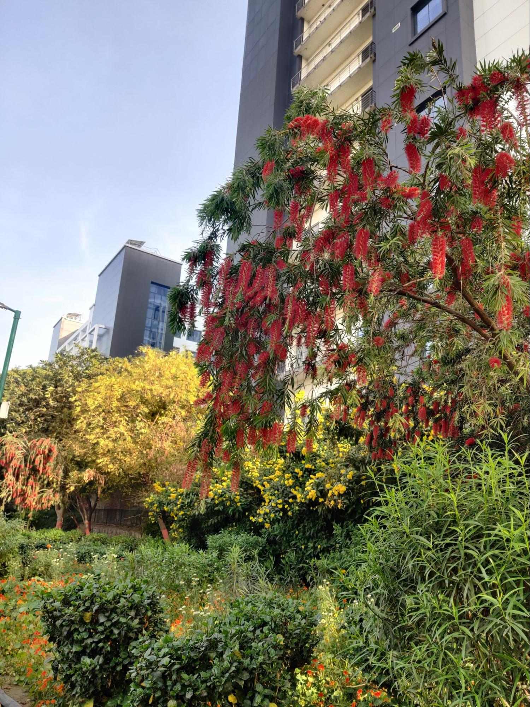
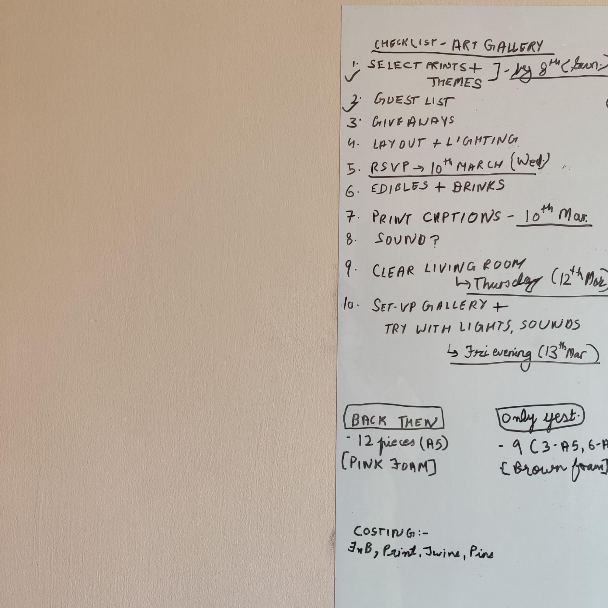
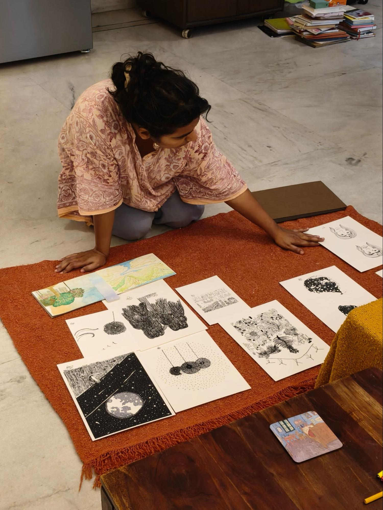
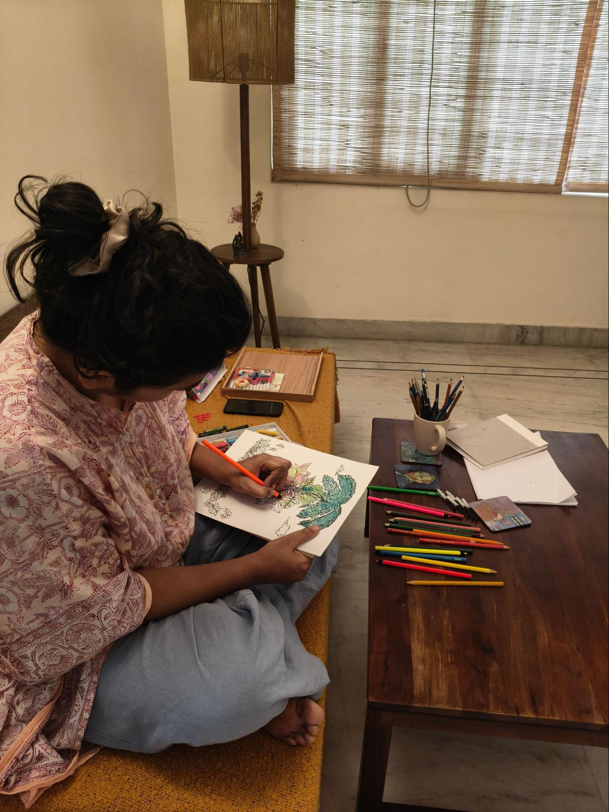
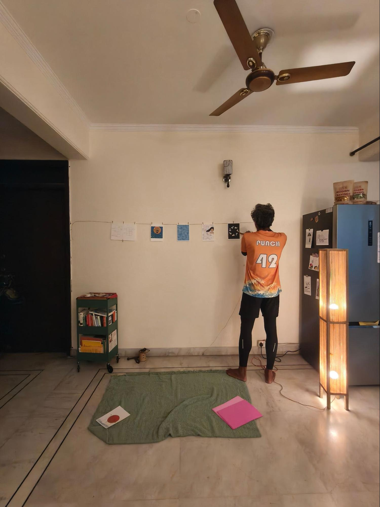
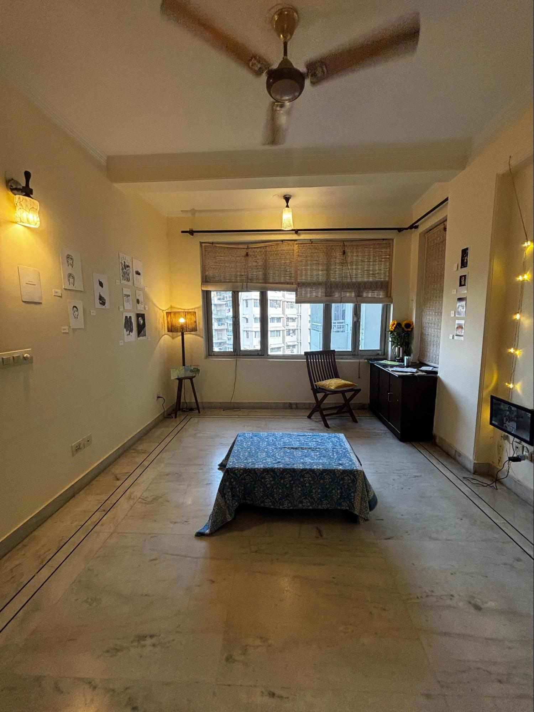

Moods have consequences.
Deluded by the colours and temperatures of spring, some circuitry serendipity occurred inside me, resulting first in an above-average-consistent pleasant mood, then in an idea, and finally, in the idea's announcement — 'Let's do an art gallery!'

Before I could pause to consider the implications of such an idea, messages had gone from my phone to at least three other phones. By sharing this burst of impromptu-ness with humans outside of my head, I had ensured that this was a done deal. So, in an act which would make old aunties and uncles gasp or look at my parents with pressed lips and pitying eyes (for their direct genetic and social linkage with me), we were going to turn our living room, the common space upon entering the house, where one entertains guests and displays their interests or the bone china crockery, into a 'gallery'. To do so, based on our understanding of living rooms and art galleries, we were going to remove comfort by moving out what little furniture we have — rented, borrowed, bought — and create a space where people would mostly stand, surrounded by my art.

Now that things were in motion, cemented by enthusiastic replies including 'yay', 'this seems like a great idea', I picked up the whiteboard marker and got to some serious, life-changing work — writing down tasks in bullets, and assigning a date of completion to each task.

Once the bullet-list mode finished, the 'event organiser' mode took over. It created a chasm between me and the possibility of entertaining any existential or ridiculous questions. Such a chasm has opened before. Between late 2022 and the start of 2023, I was awake until the early hours of mornings, facing questions which held the weight to decide how my social network would remember me —
Kulfi or Rasmalai?
Seekh kebab or Tikka?
DJ for which days?
How much alcohol is enough alcohol?
Is the final head count exceeding 150 guests?

Filling up cell after cell of a spreadsheet named 'Guests — arrival departure info' took all my focus away from the reality that I was going to marry, that I was going to be a bride — an institution, and a role I had fought against for much of my existence due to its entrenched misogynistic flavouring.

Returning from early 2023 to spring 2026, the seemingly mechanical acts of selecting the artwork for showcasing, choosing what paper to print on, and clicking 'print' took up my immediate focus, and prevented me from dwelling on what I was doing: displaying my art — some of which had been a way to cope or deal with difficult situations — outside its digital folders and 200 GSM sketchbooks to be seen, held, interpreted, and judged. Shudder. Shudder.
But adjusting the artwork borders, deciding between glossy and matte papers, checking printing error 1107 which would flash on my screen, sending RSVP messages and following up on them, distracted me from some utterly human questions:
Are you mad?
Do you know what you are doing?
How vain are you?
Do you really think this is a good idea?
Will anyone show up?
What if no one showed up?
Woman, did you brush your teeth today?

With less than twenty-four hours to go before our home opened to visitors, periods and hot chocolate entered my body. Hormones and pain had arrived to wrestle control from the knife-like focus that was my anchor through the week. With a blurring focus, panic saw its opportunity and began circling my psyche. A predator waiting for its chance. But that's where support systems show their power. And why I believe that humans cannot be absolutely self-reliant or self-loving. We need each other. As I began going numb, thinking of canceling the plan with an 'I'm sick', as my loathsome internal censor began winking at me 'Are you sure you're ready?' I found energy to push back in the loving messages from friends and family. The art gallery was going to happen.
But it was already Friday evening, close to dinner time. According to the whiteboard timelines, the gallery should have been up for pilot a few hours earlier. To see how the artwork interacted with natural, pre-dusk light, transitioning into twilight when the lamps and fairy lights would cast their spell. But there we stood, the two of us with prints scattered on the floor, unable to decide between twine and wooden clips to hang the artwork, or washi tape for sticking the artwork to the walls. Tears finally lined my eyes. I sat down. Toes and ankles swollen, feelings swinging between dim hope, rage, and nothing, abdomen turned into a punching bag by my exiting uterine lining. Before the words 'I can't' could whimper out from me, Boy asked, 'Don't you trust me?'
Uttering a 'No' would have opened a different and new channel of consequences, something I knew was not a good idea to engage with. So, I stayed silent and let him take over.

Saturday came. The gallery was set-up by 02:45pm. An hour and fifteen minutes before the given time for visitors to start coming. Boy sent me away from the remaining work. To lie down, bathe, and change clothes before we started receiving visitors. Ten people had said yes to our RSVP message. There were also last minute cancellations and inclusions.
Stepping inside the bathroom, I put on some bollywood music, and my exhausted self leaned into the nice, lukewarm water. Just then, the doorbell rang. It was showtime.

We decided to not be completely heartless. So you see a sitting table in the centre of the room, along with a chair closer to the windows. Thankful to our friend for the sunflowers in the right corner. More about flowers, people, and bakes in the upcoming parts.

Thank you for reading!
